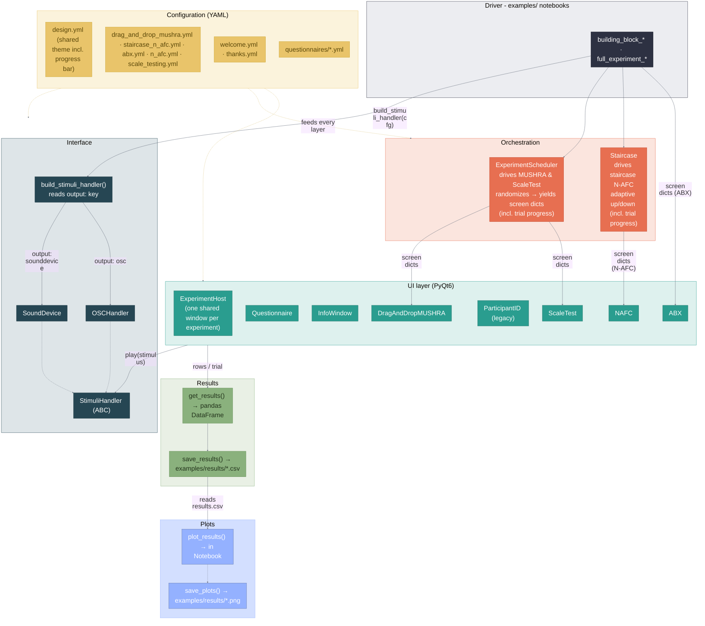

# whispy

A config-driven Python toolkit for running listening tests and/or perceptual
experiments. 
It provides PyQt6 UIs (drag-and-drop MUSHRA-like rating, N-AFC, ABX, rating
scales, questionnaires, info screens) and stimulus playback via
`sounddevice` / `pyfar` - or OSC messages to external audio software - all
driven by YAML configuration.
The tests run in Jupyter notebooks: either run a predefined full experiment
or compile your own setup from the building blocks. 

> 📑 **Presentation:** for a quick visual introduction to the project, see our
> final presentation [slide deck (PDF, in German)](docs/AbschlussPraes_PyAk.pdf).

Available predefined test setups:

- ### ABX
    Simple comparison test to distinguish perceptual differences. A reference signal and a manipulated signal are randomly assigned to A and B; one of the two is copied to X, and the participant's task is to identify whether X is equal to A or to B.
    
- ### MUSHRA (drag and drop)
    Multiple Stimuli with Hidden Reference and Anchor - test, a standardized methodology used to evaluate the perceived quality of intermediate-to-high quality audio systems, such as audio codecs, generative speech models, and spatial audio. Defined by the ITU-R BS.1534 recommendation, it allows listeners to compare multiple audio samples simultaneously against a known reference and rate them on a continuous scale from 0 to 100 (e.g., rate a difference) or -50 to 50 (e.g., lower or higher comparison).

    In this case (drag-and-drop) the participant can drag and drop the test stimuli into a rating area which allows for a more natural interaction.

- ### Staircase N-AFC
    N-AFC (N-Alternative Forced Choice): In every trial, the participant is presented with N options (usually 2, 3, or 4). For example, in a 3-AFC test, the participant is given three stimuli (e.g., three different flavors, or three time intervals) and is "forced" to choose which one is different or more intense, even if they have to guess. This prevents participants from relying on arbitrary "yes/no" criteria.

    
    Staircase (Up-Down) Method: This is the adaptive testing algorithm. The test gets harder when the participant gets answers right and easier when they get answers wrong.

- ### Scale test
    Rating test for a given stimulus (e.g., "How rough is this tone?"), answered on one or more Likert-button or slider scales stacked below a single play button.

Additionally, **questionnaires** can be added anywhere in an experiment: fully config-driven surveys with free-text, numeric, single-choice and multiple-choice questions, including follow-up questions that only appear depending on earlier answers. The predefined ones (see [`configs/questionnaires/`](configs/questionnaires/)) are a consent form - which also builds the anonymous participant ID used in the result file names - and a general questionnaire about the participant and the listening setup.

> **Config-driven:** every test can be tailored in its `configs/<test>.yml`
> file - wording, stimuli, scales, trial plan - without touching any Python.


## Installation

Clone the repository to your local machine. Navigate with `cd` to your desired 
folder and run:
```
git clone https://github.com/tomstrobl/whispy.git
```
Then change into the cloned folder and install the package with all required
dependencies:

```bash
cd whispy
pip install -e .
```

After this you can open the Jupyter notebooks in [`examples/`](examples/) in
your preferred IDE and run them.

### Requirements

- Python >= 3.11
- All Python dependencies (PyQt6, pyfar, sounddevice, pandas, ...) are
  installed automatically by `pip install -e .`

## Usage

**New to whispy (or to Python)?** Start with the step-by-step
[User Manual](docs/USER_MANUAL.md) - it covers installation, running the
demos, designing your own experiment via the YAML configs, and troubleshooting.

See the runnable demos in [`examples/`](examples/) - each test ships as a minimal
`building_block_<test>.ipynb` and a full `full_experiment_<test>.ipynb`
(welcome → consent → test → thank-you, all presented inside one shared
fullscreen window):

- `drag_and_drop_mushra` - MUSHRA-like drag-and-drop rating.
- `staircase_n_afc` - adaptive staircase driving N-AFC trials.
- `abx` - ABX discrimination.
- `scale_testing` - attribute rating on Likert-button/slider scales.

There are also building blocks for the questionnaire and the framing
welcome/thank-you screens, and `full_experiment_audience_demo.ipynb`, a
~7-minute live demo chaining all UI types.

Each notebook contains step-by-step instructions. Results are saved as CSV
files into `examples/results/`; the full experiments additionally autosave
after every trial, so even a crash mid-run loses at most the trial in
progress.


## Architecture

A Jupyter notebook (the *driver*) reads one self-contained YAML config, an *orchestrator*
turns it into a sequence of screens, a *UI* presents each screen - all inside
one shared experiment window - and plays its stimuli through the audio
*interface*, and every screen's answers are collected into a results table,
combined with a participant's ID.



> The same diagram lives in [`docs/architecture.mmd`](docs/architecture.mmd) -
> the editable source you can paste into [mermaid.live](https://mermaid.live) to
> export a PNG/SVG for slides. Keep the two in sync when you change it.


## Example User Interfaces

The ABX-test screen:


The drag-and-drop-MUSHRA-test screen:


## Authors and acknowledgement

- Brinkmann, Fabian
- Strobl, Tom
- Ventura, Aron Manuel
- Will, Maximilian

## License

MIT - see [`LICENSE`](LICENSE).
