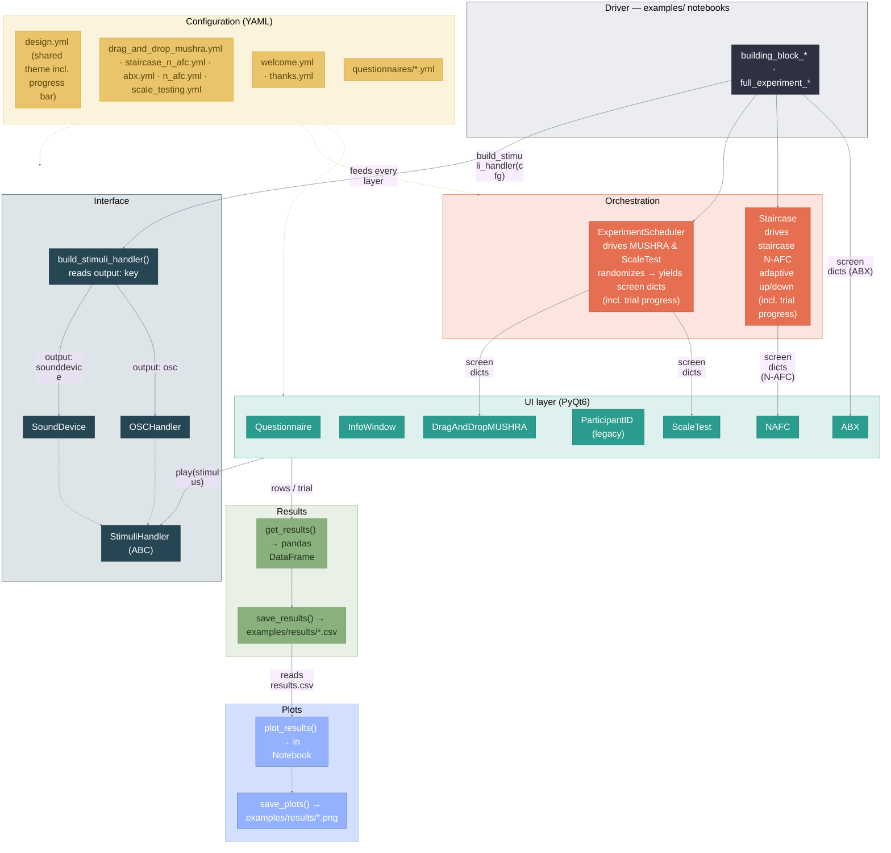
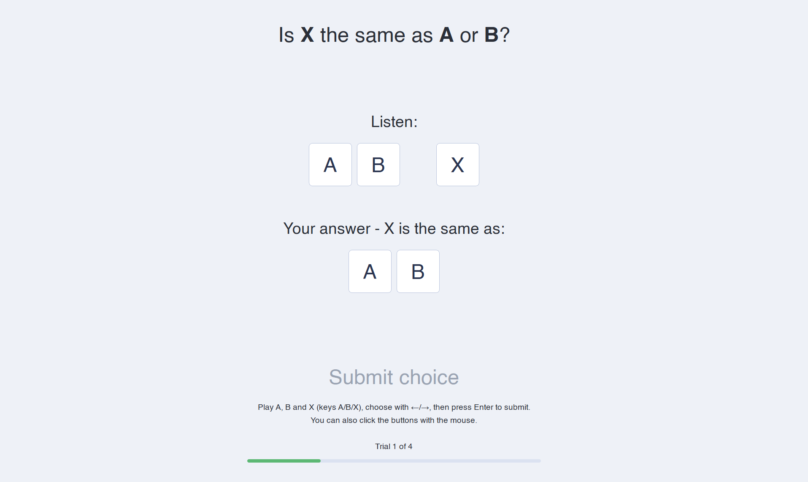
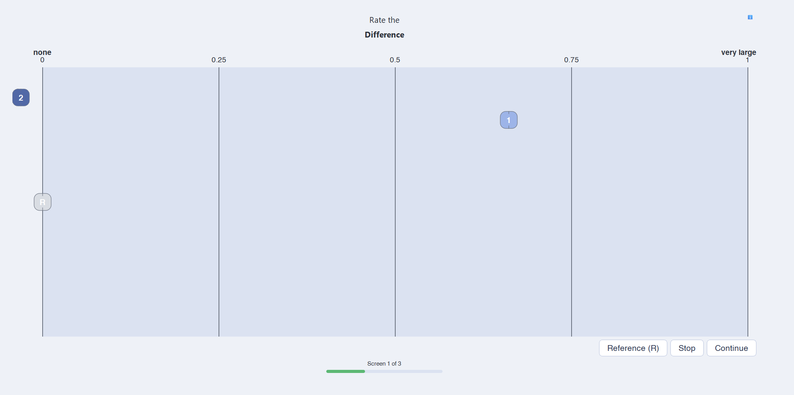

# whispy

A config-driven Python toolkit for running listening tests and/or perceptual
experiments. 
It provides PyQt6 UIs (drag-and-drop MUSHRA-like rating, N-AFC,
questionnaires, info screens) and audio playback via `sounddevice` / `pyfar`,
all driven by YAML configuration.
The tests run in jupyter notebooks and either predefined full experiments can 
be chosen or individual test setups can be compiled from the building blocks. 

> 📑 **Presentation:** for a quick visual introduction to the project, see our
> final presentation [slide deck (PDF, in German)](docs/AbschlussPraes_PyAk.pdf).

Available predefined test setups:

- ### ABX
    Simple comparison test to distinguish perceptual differences. A reference signal and a manipulated signal is randomly assigned to A and B and also to X and the participant's task is to identify whether A is equal to X or B is equal to X.
    
- ### MUSHRA (drag and drop)
    MUltiple Stimuli with Hidden Reference and Anchor - test, a standardized methodology used to evaluate the perceived quality of intermediate-to-high quality audio systems, such as audio codecs, generative speech models, and spatial audio. Defined by the ITU-R BS. 1534 recommendation, it allows listeners to compare multiple audio samples simultaneously against a known reference and rate them on a continuous scale from 0 to 100 (e.g., rate a difference) or -50 to 50 (e.g., lower or higher comparison).

    In this case (drag-and-drop) the participant can drag and drop the test stimuli into a rating area which allows for a more natural interaction.

- ### Staircase N-AFC
    N-AFC (N-Alternative Forced Choice): In every trial, the participant is presented with N options (usually 2, 3, or 4). For example, in a 3-AFC test, the participant is given three stimuli (e.g., three different flavors, or three time intervals) and is "forced" to choose which one is different or more intense, even if they have to guess. This prevents participants from relying on arbitrary "yes/no" criteria.

    
    Staircase (Up-Down) Method: This is the adaptive testing algorithm. The test gets harder when the participant gets answers right and easier when they get answers wrong.

- ### Scale test
    Rating test for a given stimulus (e.g., "How rough is this tone?")

#### *`Every test can be tailored in the respective <test>.yml config-files to meet the individual requirements.`*


## Installation

Clone the repository to your local machine. Navigate with `cd` to your desired 
folder and run:
```
git clone https://github.com/tomstrobl/whispy.git
```
Next, run:

```bash
pip install -e .
```
in your terminal to install all required packages. After this you can open the 
jupyter notebooks in your preferred IDE and the whispy-blocks are executable.

### Requirements

works with:
- python versions >= 3.13.13 
- anaconda >= 22.9.0

## Usage

**New to whispy (or to Python)?** Start with the step-by-step
[User Manual](docs/USER_MANUAL.md) - it covers installation, running the
demos, designing your own experiment via the YAML configs, and troubleshooting.

See the runnable demos in [`examples/`](examples/) — each test ships as a minimal
`building_block_<test>.ipynb` and a full `full_experiment_<test>.ipynb` (consent
→ test → thank-you):

- `drag_and_drop_mushra` — MUSHRA-like drag-and-drop rating.
- `staircase_n_afc` — adaptive staircase driving N-AFC trials.
- `abx` — ABX discrimination.

Each building_block_<test>.ipynb- and full_experiment_<test>.ipynb-file provides additional 
instructions for smooth use.


## Architecture

A jupyter-notebook (the *driver*) reads one self-contained YAML config, an *orchestrator*
turns it into a sequence of screens, a *UI* presents each screen and plays its
stimuli through the audio *interface*, and every screen's answers are collected 
into a results table, combined with a participant's ID.



> The same diagram lives in [`docs/architecture.mmd`](docs/architecture.mmd) —
> the editable source you can paste into [mermaid.live](https://mermaid.live) to
> export a PNG/SVG for slides. Keep the two in sync when you change it.


## Example User Interfaces

The ABX-test screen:



The drag-and-drop-MUSHRA-test screen:



## Authors and acknowledgement

Brinkmann, Fabian; 
Strobl, Tom; 
Goldfuss, Jonathan; 
Ventura, Aron Manuel; 
Will, Maximilian; 

## License

MIT — see [`LICENSE`](LICENSE).
