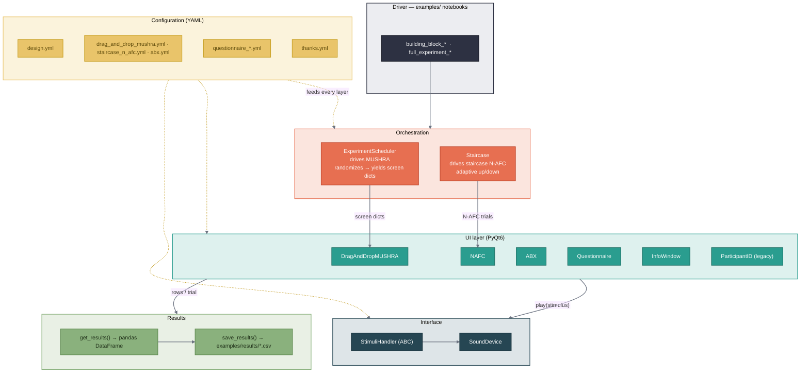

# whispy

A config-driven Python toolkit for running listening tests / perceptual
experiments. It provides PyQt6 UIs (drag-and-drop MUSHRA-like rating, N-AFC,
questionnaires, info screens) and audio playback via `sounddevice` / `pyfar`,
all driven by YAML configuration.

## Installation

```bash
pip install -e .
```

## Quick start

```python
import whispy
from whispy.interfaces import SoundDevice

config = "configs/drag_and_drop_mushra.yml"   # one self-contained experiment file
cfg = whispy.utils.read_config(config)
handler = SoundDevice(config, "examples/demo_stimuli/mushra")  # reads the SoundDevice: block

# Randomized course of trials from the config's `experiment:` block
schedule = whispy.ExperimentScheduler(experiment=cfg)

results = None
for screen in schedule:
    ui = whispy.ui.DragAndDropMUSHRA(
        screen=screen, stimuli_handler=handler, drag_and_drop_mushra=cfg)
    results = ui.get_results(results)
```

See the runnable demos in [`examples/`](examples/) — each test ships as a minimal
`building_block_<test>.ipynb` and a full `full_experiment_<test>.ipynb` (consent
→ test → thank-you):

- `drag_and_drop_mushra` — MUSHRA-like drag-and-drop rating.
- `staircase_n_afc` — adaptive staircase driving N-AFC trials.
- `abx` — ABX discrimination.

## Architecture

A notebook (the *driver*) reads one self-contained YAML config, an *orchestrator*
turns it into a sequence of screens, a *UI* presents each screen and plays its
stimuli through the audio *interface*, and every screen's answers are collected
into a results table.



> The same diagram lives in [`docs/architecture.mmd`](docs/architecture.mmd) —
> the editable source you can paste into [mermaid.live](https://mermaid.live) to
> export a PNG/SVG for slides. Keep the two in sync when you change it.

## License

MIT — see [`LICENSE`](LICENSE).
