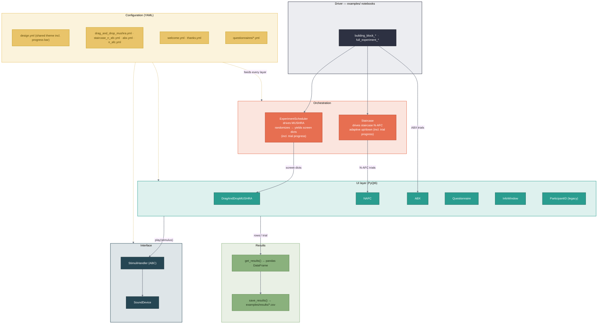

# whispy

A config-driven Python toolkit for running listening tests and/or perceptual
experiments. 
It provides PyQt6 UIs (drag-and-drop MUSHRA-like rating, N-AFC,
questionnaires, info screens) and audio playback via `sounddevice` / `pyfar`,
all driven by YAML configuration.
The tests run in jupyter notebooks and either predefined full experiments can 
be chosen or individual test setups can be compiled from the building blocks. 

Available predefined test setups:

- ABX
- Mushra (Drag and drop)
- Staircase N-AFC

## User Interface

The welcome screen, first seen by the participant (can be configured in <welcome.yml>):


The ID and consent screen. There the participant sets his own ID, gives (or rejects)
the use of the respective data and is able to collect listening hours needed as a 
Audiocommunication and -technoligy student:


The ABX-test screen:


A drag-and-drop-MUSHRA Info-window explaining the following task:


The drag-and-drop-MUSHRA-test screen:


The Staircase N-AFC-test screen


The thank you screen (the shown greeting can be configured in <thanks.yml>):


## Installation

Clone the repository to your local mashine. Navigate with `cd` to your desired 
folder and run:
```
git clone https://github.com/tomstrobl/whispy.git
```
Next, run:

```bash
pip install -e .
```
in your terminal to install all required packages. After this you can open the 
jupyter notebooks in your prefered IDE and the whispy-blocks are executable.

### Requirements

Whispy runs in:
*already tested*
- Visual Studio Code
- 

and works with:
- python verions >= 3.13.13 
- anaconda >= 22.9.0


## Usage

**New to whispy (or to Python)?** Start with the step-by-step
[User Manual](docs/USER_MANUAL.md) - it covers installation, running the
demos, designing your own experiment via the YAML configs, and troubleshooting.

See the runnable demos in [`examples/`](examples/) — each test ships as a minimal
`building_block_<test>.ipynb` and a full `full_experiment_<test>.ipynb` (consent
→ test → thank-you):

- `drag_and_drop_mushra` — MUSHRA-like drag-and-drop rating.
- `staircase_n_afc` — adaptive staircase driving N-AFC trials.
- `abx` — ABX discrimination.

Each building_block_<test>.ipynb and full_experiment_<test>.ipynb provides additional 
instructions for smooth use.

### Quick start

```python
import whispy
from whispy.interfaces import SoundDevice

config = "configs/drag_and_drop_mushra.yml"   # one self-contained experiment file
cfg = whispy.utils.read_config(config)
handler = SoundDevice(config, "examples/demo_stimuli/mushra")  # reads the SoundDevice: block

# Randomized course of trials from the config's `experiment:` block
schedule = whispy.ExperimentScheduler(experiment=cfg)

results = None
for screen in schedule:
    ui = whispy.ui.DragAndDropMUSHRA(
        screen=screen, stimuli_handler=handler, drag_and_drop_mushra=cfg)
    results = ui.get_results(results)
```

## Architecture

A jupyter-notebook (the *driver*) reads one self-contained YAML config, an *orchestrator*
turns it into a sequence of screens, a *UI* presents each screen and plays its
stimuli through the audio *interface*, and every screen's answers are collected 
into a results table, combined with a participants ID.



> The same diagram lives in [`docs/architecture.mmd`](docs/architecture.mmd) —
> the editable source you can paste into [mermaid.live](https://mermaid.live) to
> export a PNG/SVG for slides. Keep the two in sync when you change it.

## Authors and acknowledgement

Brinkmann, Fabian; 
Strobl, Tom; 
Goldfuss, Jonathan; 
Ventura, Aron Manuel; 
Will, Maximilian; 

## License

MIT — see [`LICENSE`](LICENSE).
